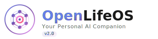
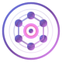
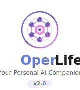
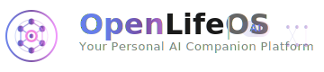

# OpenLifeOS Brand Guidelines

## Logo Overview

The OpenLifeOS logo represents the convergence of artificial intelligence, neural networks, and human consciousness. The design embodies our mission to democratize personal AI through an open, extensible platform.

## Logo Preview Gallery

### Primary Logo


### Dark Mode Logo


### Icon Only


### Vertical Layout


### Horizontal Extended


## Logo Variations

### 1. Primary Logo (`openlifeos-logo.svg`)
- **Usage**: Default logo for most applications
- **Dimensions**: 240x80px
- **Format**: Horizontal layout with icon and text
- **Application**: Website headers, documentation, presentations

### 2. Dark Mode Logo (`openlifeos-logo-dark.svg`)
- **Usage**: Dark backgrounds and night mode interfaces
- **Dimensions**: 240x80px
- **Format**: Optimized colors for dark themes
- **Application**: Dark mode UIs, terminal applications

### 3. Icon Only (`openlifeos-icon.svg`)
- **Usage**: App icons, favicons, compact spaces
- **Dimensions**: 80x80px (scalable)
- **Format**: Symbol only, no text
- **Application**: Mobile apps, browser tabs, social media avatars

### 4. Vertical Layout (`openlifeos-logo-vertical.svg`)
- **Usage**: Narrow spaces, mobile layouts
- **Dimensions**: 160x180px
- **Format**: Stacked icon above text
- **Application**: Mobile splash screens, vertical banners

### 5. Horizontal Extended (`openlifeos-logo-horizontal.svg`)
- **Usage**: Wide headers, banners
- **Dimensions**: 360x80px
- **Format**: Extended horizontal with decorative elements
- **Application**: Website banners, email signatures

## Logo Elements

### Neural Network Symbol
The interconnected nodes represent:
- **Distributed Intelligence**: Multiple processing points working together
- **Connectivity**: The integration of various data sources and services
- **Growth**: The expanding capability of the AI companion

### Central Core
The pulsing central core symbolizes:
- **AI Consciousness**: The living, breathing nature of the AI companion
- **Personal Connection**: The intimate relationship between user and AI
- **Continuous Learning**: The ever-evolving intelligence

### Animation Elements
The subtle pulse animations convey:
- **Life**: The system is alive and responsive
- **Activity**: Continuous processing and learning
- **Energy**: The dynamic nature of the platform

## Color Palette

### Primary Gradient
```css
/* Purple to Pink Gradient */
#667eea → #764ba2 → #f093fb
```
- **Purpose**: Innovation, creativity, intelligence
- **Usage**: Primary brand elements, CTAs, highlights

### Accent Gradient
```css
/* Orange to Pink Gradient */
#f5576c → #f093fb
```
- **Purpose**: Energy, warmth, human connection
- **Usage**: Core elements, notifications, active states

### Dark Mode Colors
```css
/* Lighter Purple Gradient */
#818cf8 → #c084fc

/* Warm Accent */
#fbbf24 → #f97316
```

### Text Colors
- **Primary Text**: `#1a1a1a` (light mode) / `#ffffff` (dark mode)
- **Secondary Text**: `#666666` (light mode) / `#a0a0a0` (dark mode)
- **Muted Text**: `#888888` (light mode) / `#606060` (dark mode)

## Typography

### Primary Font
**Inter** (with system font fallbacks)
```css
font-family: 'Inter', -apple-system, BlinkMacSystemFont, 'Segoe UI', Roboto, sans-serif;
```

### Font Weights
- **Extra Bold (800)**: Main brand name
- **Bold (700)**: Headers, emphasis
- **Semi-Bold (600)**: Subheaders, badges
- **Regular (400)**: Body text, descriptions
- **Light (300)**: Decorative elements

## Usage Guidelines

### Minimum Size
- **Full Logo**: Minimum width 120px
- **Icon Only**: Minimum 32x32px
- **Ensure legibility** at all sizes

### Clear Space
Maintain clear space around the logo equal to the height of the "O" in "OpenLifeOS"

### Background Usage
- **Light Backgrounds**: Use primary logo
- **Dark Backgrounds**: Use dark mode variant
- **Colored Backgrounds**: Ensure sufficient contrast
- **Busy Backgrounds**: Add subtle drop shadow or use icon with background shape

### Do's
✓ Use provided SVG files for scalability
✓ Maintain aspect ratio when scaling
✓ Use appropriate variant for context
✓ Respect clear space guidelines
✓ Use on backgrounds with sufficient contrast

### Don'ts
✗ Don't alter colors without approval
✗ Don't distort or stretch the logo
✗ Don't add effects (shadows, outlines) unless specified
✗ Don't combine with other logos without spacing
✗ Don't use low-resolution versions

## File Formats

### SVG (Preferred)
- **Advantages**: Scalable, small file size, supports animation
- **Usage**: Web, applications, print

### PNG (Alternative)
Export from SVG when needed:
- **@1x**: Standard resolution
- **@2x**: Retina displays
- **@3x**: High-DPI mobile devices

### ICO/ICNS
For application icons:
- **ICO**: Windows applications
- **ICNS**: macOS applications
- **Multiple sizes**: 16x16, 32x32, 48x48, 64x64, 128x128, 256x256, 512x512

## Implementation Examples

### HTML
```html
<!-- Primary Logo -->


<!-- Dark Mode -->


<!-- Icon Only -->
<link rel="icon" type="image/svg+xml" href="/assets/logo/openlifeos-icon.svg">
```

### CSS
```css
/* Logo with hover effect */
.logo {
  transition: transform 0.3s ease;
}

.logo:hover {
  transform: scale(1.05);
}

/* Dark mode switching */
@media (prefers-color-scheme: dark) {
  .logo-adaptive {
    content: url('/assets/logo/openlifeos-logo-dark.svg');
  }
}
```

### React Component
```jsx
import { ReactComponent as Logo } from '@/assets/logo/openlifeos-logo.svg';

function Header() {
  return <Logo className="h-10 w-auto" />;
}
```

## Brand Voice

When presenting the logo, accompany it with messaging that reflects:
- **Open Innovation**: "The Linux of Personal AI"
- **Personal Growth**: "AI that grows with you"
- **Privacy First**: "Your data, your control"
- **Community Driven**: "Built by the community, for everyone"

## Contact

For brand usage questions or custom implementations:
- GitHub: [OpenLifeOS Repository](https://github.com/openlifeos)
- Documentation: [Brand Assets](https://docs.openlifeos.ai/brand)

---

*These guidelines ensure consistent, professional representation of the OpenLifeOS brand across all platforms and media.*