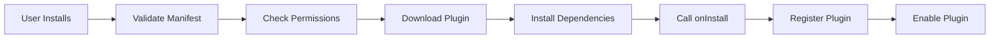

# OpenLifeOS Plugin Development Guide

## Introduction

OpenLifeOS plugins extend the platform's capabilities, allowing developers to create custom experiences, integrate new devices, and add specialized functionality. This guide covers everything you need to know to build powerful plugins.

## Table of Contents

1. [Getting Started](#getting-started)
2. [Plugin Structure](#plugin-structure)
3. [Plugin Lifecycle](#plugin-lifecycle)
4. [Available APIs](#available-apis)
5. [Event Handling](#event-handling)
6. [Data Access](#data-access)
7. [UI Components](#ui-components)
8. [Testing Plugins](#testing-plugins)
9. [Publishing Plugins](#publishing-plugins)
10. [Best Practices](#best-practices)
11. [Example Plugins](#example-plugins)

## Getting Started

### Prerequisites

- Node.js 16+ or compatible JavaScript runtime
- Basic understanding of JavaScript/TypeScript
- OpenLifeOS SDK (`npm install @openlifeos/sdk`)

### Quick Start

```bash
# Install OpenLifeOS CLI
npm install -g @openlifeos/cli

# Create a new plugin
openlifeos plugin create my-plugin

# Navigate to plugin directory
cd my-plugin

# Install dependencies
npm install

# Start development
npm run dev
```

### Plugin Template

```javascript
// index.js
export default class MyPlugin {
  constructor() {
    this.id = 'my-plugin';
    this.name = 'My Plugin';
    this.version = '1.0.0';
    this.author = 'Your Name';
    this.description = 'A OpenLifeOS plugin that does amazing things';
    this.permissions = ['biometric.read', 'storage.write'];
  }
  
  async onInstall(context) {
    console.log('Plugin installed!');
  }
  
  async onEnable(context) {
    console.log('Plugin enabled!');
  }
  
  async onEvent(event, context) {
    console.log('Event received:', event);
  }
  
  async onDisable(context) {
    console.log('Plugin disabled!');
  }
  
  async onUninstall(context) {
    console.log('Plugin uninstalled!');
  }
}
```

## Plugin Structure

### Directory Layout

```
my-plugin/
├── package.json           # NPM package configuration
├── manifest.json          # Plugin manifest
├── README.md             # Plugin documentation
├── LICENSE               # License file
├── src/
│   ├── index.js          # Main plugin file
│   ├── handlers/         # Event handlers
│   ├── components/       # UI components
│   ├── utils/           # Utility functions
│   └── api/             # API endpoints
├── test/
│   └── plugin.test.js    # Plugin tests
├── assets/
│   ├── icon.png         # Plugin icon
│   └── screenshots/     # Screenshots
└── locales/
    ├── en.json          # English translations
    └── es.json          # Spanish translations
```

### Manifest File

```json
{
  "id": "my-plugin",
  "name": "My Plugin",
  "version": "1.0.0",
  "description": "A OpenLifeOS plugin that enhances your experience",
  "author": {
    "name": "Your Name",
    "email": "you@example.com",
    "url": "https://yourwebsite.com"
  },
  "homepage": "https://github.com/yourusername/my-plugin",
  "repository": {
    "type": "git",
    "url": "https://github.com/yourusername/my-plugin.git"
  },
  "license": "MIT",
  "main": "src/index.js",
  "icon": "assets/icon.png",
  "categories": ["productivity", "wellness"],
  "keywords": ["openopenlifeos", "plugin", "productivity"],
  "permissions": [
    "biometric.read",
    "storage.write",
    "notifications.send",
    "ui.registerComponent"
  ],
  "minOpenLifeOSVersion": "1.0.0",
  "maxOpenLifeOSVersion": "2.0.0",
  "settings": {
    "schema": {
      "type": "object",
      "properties": {
        "enabled": {
          "type": "boolean",
          "default": true,
          "title": "Enable Plugin"
        },
        "threshold": {
          "type": "number",
          "default": 100,
          "title": "Alert Threshold",
          "description": "Trigger alerts above this value"
        }
      }
    }
  },
  "endpoints": [
    {
      "path": "/api/my-plugin/status",
      "method": "GET",
      "handler": "getStatus"
    }
  ],
  "events": [
    "biometric.heartRate",
    "system.wake",
    "pattern.detected"
  ],
  "components": [
    {
      "name": "MyWidget",
      "type": "widget",
      "path": "src/components/MyWidget.js"
    }
  ],
  "tasks": [
    {
      "name": "dailyReport",
      "schedule": "0 9 * * *",
      "handler": "generateDailyReport"
    }
  ]
}
```

## Plugin Lifecycle

### Installation Flow



### Lifecycle Methods

```javascript
class PluginLifecycle {
  /**
   * Called once when plugin is installed
   * Use for: Initial setup, creating storage schema
   */
  async onInstall(context) {
    await context.storage.set('installDate', Date.now());
    await context.storage.set('config', defaultConfig);
    context.utils.log('info', 'Plugin installed successfully');
  }
  
  /**
   * Called when plugin is enabled
   * Use for: Starting services, registering listeners
   */
  async onEnable(context) {
    this.subscription = context.events.on('biometric.*', this.handleBiometric);
    this.interval = setInterval(() => this.checkStatus(context), 60000);
    context.utils.log('info', 'Plugin enabled');
  }
  
  /**
   * Called when plugin is disabled
   * Use for: Stopping services, cleanup
   */
  async onDisable(context) {
    if (this.subscription) this.subscription.unsubscribe();
    if (this.interval) clearInterval(this.interval);
    context.utils.log('info', 'Plugin disabled');
  }
  
  /**
   * Called once when plugin is uninstalled
   * Use for: Final cleanup, data export
   */
  async onUninstall(context) {
    const userData = await context.storage.get('userData');
    if (userData) {
      await context.utils.exportData(userData);
    }
    await context.storage.clear();
    context.utils.log('info', 'Plugin uninstalled');
  }
  
  /**
   * Called when plugin is updated
   * Use for: Migration, schema updates
   */
  async onUpdate(context, previousVersion) {
    if (previousVersion < '2.0.0') {
      await this.migrateToV2(context);
    }
    context.utils.log('info', `Updated from ${previousVersion} to ${this.version}`);
  }
}
```

## Available APIs

### Storage API

```javascript
// Store data
await context.storage.set('key', { data: 'value' });

// Retrieve data
const data = await context.storage.get('key');

// Delete data
await context.storage.delete('key');

// Clear all plugin data
await context.storage.clear();

// List all keys
const keys = await context.storage.keys();

// Batch operations
await context.storage.batch([
  { op: 'set', key: 'key1', value: 'value1' },
  { op: 'set', key: 'key2', value: 'value2' },
  { op: 'delete', key: 'key3' }
]);
```

### Events API

```javascript
// Emit an event
context.events.emit('my-plugin.alert', {
  level: 'warning',
  message: 'Something needs attention'
});

// Subscribe to events
const subscription = context.events.on('biometric.heartRate', (event) => {
  console.log('Heart rate:', event.data.value);
});

// Pattern matching
context.events.on('biometric.*', (event) => {
  console.log('Any biometric event:', event);
});

// Unsubscribe
subscription.unsubscribe();

// Request-response pattern
const response = await context.events.request('ai.query', {
  question: 'How am I doing today?'
});
```

### Data Access API

```javascript
// Get current biometric data
const heartRate = await context.data.getBiometric('heartRate');

// Get historical data
const history = await context.data.getHistory('biometric.heartRate', {
  from: Date.now() - 86400000, // Last 24 hours
  to: Date.now(),
  resolution: '1h' // Hourly aggregation
});

// Query memories
const memories = await context.data.getMemories({
  type: 'episodic',
  timeRange: 'last_week',
  limit: 10
});

// Get personality traits
const personality = await context.data.getPersonality();

// Get current state
const state = await context.data.getState();
```

### UI API

```javascript
// Show notification
context.ui.showNotification({
  title: 'Alert',
  message: 'Your heart rate is elevated',
  icon: 'warning',
  actions: [
    { label: 'View Details', action: 'view' },
    { label: 'Dismiss', action: 'dismiss' }
  ]
});

// Show dialog
const result = await context.ui.showDialog({
  title: 'Confirm Action',
  message: 'Are you sure you want to proceed?',
  buttons: ['Yes', 'No']
});

// Register a widget
context.ui.registerWidget({
  id: 'my-widget',
  title: 'My Widget',
  render: () => {
    return `<div>Widget Content</div>`;
  }
});

// Update status bar
context.ui.setStatusBar({
  text: 'Plugin Active',
  color: 'green'
});
```

### Utils API

```javascript
// Logging
context.utils.log('info', 'Something happened');
context.utils.log('error', 'An error occurred', { details: error });

// HTTP requests
const response = await context.utils.http({
  method: 'GET',
  url: 'https://api.example.com/data',
  headers: { 'Authorization': 'Bearer token' }
});

// Schedule tasks
const task = await context.utils.schedule({
  name: 'daily-check',
  cron: '0 9 * * *', // Every day at 9 AM
  handler: async () => {
    await this.performDailyCheck();
  }
});

// Cancel scheduled task
await task.cancel();

// Crypto utilities
const hash = await context.utils.crypto.hash('SHA256', data);
const encrypted = await context.utils.crypto.encrypt(data, key);
const decrypted = await context.utils.crypto.decrypt(encrypted, key);
```

## Event Handling

### Event Types

```javascript
// System Events
'system.startup'          // OpenLifeOS started
'system.shutdown'         // OpenLifeOS shutting down
'system.sleep'           // Device going to sleep
'system.wake'            // Device waking up

// Biometric Events
'biometric.heartRate'    // Heart rate update
'biometric.steps'        // Step count update
'biometric.sleep'        // Sleep data available

// Digital Events
'digital.appOpen'        // App opened
'digital.appClose'       // App closed
'digital.notification'   // Notification received

// Pattern Events
'pattern.stress'         // Stress pattern detected
'pattern.flow'          // Flow state detected
'pattern.fatigue'       // Fatigue detected

// AI Events
'ai.interaction'        // User interacted with AI
'ai.response'          // AI generated response
'ai.learning'          // AI learned something
```

### Event Handler Example

```javascript
class EventHandler {
  async handleBiometric(event, context) {
    const { type, data } = event;
    
    switch(type) {
      case 'biometric.heartRate':
        await this.processHeartRate(data, context);
        break;
      
      case 'biometric.steps':
        await this.processSteps(data, context);
        break;
      
      case 'biometric.sleep':
        await this.processSleep(data, context);
        break;
    }
  }
  
  async processHeartRate(data, context) {
    const { value, timestamp } = data;
    
    // Store in history
    const history = await context.storage.get('hrHistory') || [];
    history.push({ value, timestamp });
    await context.storage.set('hrHistory', history);
    
    // Check for anomalies
    if (value > 100 && data.activity === 'resting') {
      await context.ui.showNotification({
        title: 'High Resting Heart Rate',
        message: `Your heart rate is ${value} BPM`,
        priority: 'high'
      });
    }
  }
}
```

## Data Access

### Querying Data

```javascript
// Time-series queries
const heartRateData = await context.data.query({
  metric: 'biometric.heartRate',
  aggregation: 'avg',
  interval: '1h',
  from: '2024-01-01',
  to: '2024-01-31'
});

// Pattern queries
const patterns = await context.data.getPatterns({
  type: 'stress',
  confidence: { min: 0.7 },
  timeRange: 'last_month'
});

// Memory queries
const memories = await context.data.searchMemories({
  query: 'exercise',
  type: 'episodic',
  emotional_intensity: { min: 0.5 }
});
```

### Data Aggregation

```javascript
class DataAggregator {
  async getDailyStats(context) {
    const today = new Date().toISOString().split('T')[0];
    
    const [steps, heartRate, stress] = await Promise.all([
      context.data.query({
        metric: 'biometric.steps',
        aggregation: 'sum',
        date: today
      }),
      context.data.query({
        metric: 'biometric.heartRate',
        aggregation: 'avg',
        date: today
      }),
      context.data.query({
        metric: 'emotional.stress',
        aggregation: 'avg',
        date: today
      })
    ]);
    
    return {
      date: today,
      steps: steps.value,
      avgHeartRate: heartRate.value,
      avgStress: stress.value
    };
  }
}
```

## UI Components

### Widget Development

```javascript
// MyWidget.js
export class MyWidget {
  constructor(context) {
    this.context = context;
    this.state = {
      value: 0,
      trend: 'stable'
    };
  }
  
  async init() {
    // Initialize widget
    const data = await this.context.storage.get('widgetData');
    if (data) {
      this.state = data;
    }
  }
  
  render() {
    return `
      <div class="widget-container">
        <h3 class="widget-title">My Metric</h3>
        <div class="widget-value">${this.state.value}</div>
        <div class="widget-trend ${this.state.trend}">
          ${this.getTrendIcon()}
        </div>
      </div>
    `;
  }
  
  getTrendIcon() {
    switch(this.state.trend) {
      case 'up': return '↑';
      case 'down': return '↓';
      default: return '→';
    }
  }
  
  async update(newData) {
    this.state = { ...this.state, ...newData };
    await this.context.storage.set('widgetData', this.state);
    this.refresh();
  }
  
  refresh() {
    // Trigger UI refresh
    this.context.ui.refreshWidget(this.id);
  }
}
```

### Custom UI Components

```javascript
// Register custom component
context.ui.registerComponent({
  name: 'StressMonitor',
  type: 'panel',
  render: (props) => {
    return `
      <div class="stress-monitor">
        <canvas id="stress-chart"></canvas>
        <div class="stress-level">
          Current: ${props.currentStress}%
        </div>
      </div>
    `;
  },
  onMount: (element, props) => {
    // Initialize chart
    const chart = new Chart(element.querySelector('#stress-chart'), {
      type: 'line',
      data: props.chartData
    });
  },
  onUpdate: (element, props) => {
    // Update chart data
  },
  onUnmount: (element) => {
    // Cleanup
  }
});
```

## Testing Plugins

### Unit Testing

```javascript
// test/plugin.test.js
import { describe, it, expect, beforeEach } from '@jest/globals';
import MyPlugin from '../src/index.js';

describe('MyPlugin', () => {
  let plugin;
  let mockContext;
  
  beforeEach(() => {
    plugin = new MyPlugin();
    mockContext = {
      storage: {
        get: jest.fn(),
        set: jest.fn()
      },
      events: {
        emit: jest.fn(),
        on: jest.fn()
      },
      utils: {
        log: jest.fn()
      }
    };
  });
  
  it('should initialize correctly', async () => {
    await plugin.onInstall(mockContext);
    
    expect(mockContext.storage.set).toHaveBeenCalledWith(
      'installDate',
      expect.any(Number)
    );
  });
  
  it('should handle heart rate events', async () => {
    const event = {
      type: 'biometric.heartRate',
      data: { value: 120 }
    };
    
    await plugin.onEvent(event, mockContext);
    
    expect(mockContext.ui.showNotification).toHaveBeenCalled();
  });
});
```

### Integration Testing

```javascript
// test/integration.test.js
import { OpenLifeOSTestHarness } from '@openlifeos/test-utils';

describe('Plugin Integration', () => {
  let harness;
  
  beforeEach(async () => {
    harness = new OpenLifeOSTestHarness();
    await harness.loadPlugin('./dist/my-plugin.js');
  });
  
  it('should process events correctly', async () => {
    // Simulate event
    await harness.emitEvent({
      type: 'biometric.heartRate',
      data: { value: 80 }
    });
    
    // Check storage
    const stored = await harness.getPluginStorage('my-plugin', 'hrHistory');
    expect(stored).toHaveLength(1);
    expect(stored[0].value).toBe(80);
  });
});
```

### Testing Best Practices

1. **Mock external dependencies**
2. **Test error handling**
3. **Test edge cases**
4. **Test performance with large datasets**
5. **Test permission boundaries**
6. **Test UI components in isolation**

## Publishing Plugins

### Preparation

```bash
# Run tests
npm test

# Build plugin
npm run build

# Validate manifest
openlifeos plugin validate

# Check compatibility
openlifeos plugin check-compatibility
```

### Publishing to Registry

```bash
# Login to OpenLifeOS registry
openlifeos login

# Publish plugin
openlifeos plugin publish

# Or publish with npm
npm publish --registry https://registry.openlifeos.dev
```

### Plugin Metadata

```json
{
  "name": "@openlifeos/my-plugin",
  "version": "1.0.0",
  "description": "My awesome OpenLifeOS plugin",
  "keywords": ["openlifeos-plugin", "productivity", "wellness"],
  "homepage": "https://github.com/username/my-plugin",
  "bugs": {
    "url": "https://github.com/username/my-plugin/issues"
  },
  "repository": {
    "type": "git",
    "url": "https://github.com/username/my-plugin.git"
  },
  "engines": {
    "openlifeos": ">=1.0.0"
  }
}
```

## Best Practices

### Performance

```javascript
// ❌ Bad: Synchronous heavy computation
onEvent(event) {
  const result = heavyComputation(event.data);
  return result;
}

// ✅ Good: Asynchronous with worker
async onEvent(event) {
  const result = await this.worker.compute(event.data);
  return result;
}

// ❌ Bad: Frequent storage writes
onEvent(event) {
  this.data.push(event);
  context.storage.set('data', this.data); // Every event
}

// ✅ Good: Batch storage writes
onEvent(event) {
  this.buffer.push(event);
  if (this.buffer.length >= 100) {
    await context.storage.set('data', this.buffer);
    this.buffer = [];
  }
}
```

### Security

```javascript
// ❌ Bad: Direct user input in queries
const data = await context.data.query({
  filter: userInput // Dangerous!
});

// ✅ Good: Validate and sanitize input
const sanitized = this.sanitizeInput(userInput);
const data = await context.data.query({
  filter: sanitized
});

// ❌ Bad: Storing sensitive data unencrypted
await context.storage.set('apiKey', plainTextKey);

// ✅ Good: Encrypt sensitive data
const encrypted = await context.utils.crypto.encrypt(plainTextKey);
await context.storage.set('apiKey', encrypted);
```

### Error Handling

```javascript
class RobustPlugin {
  async onEvent(event, context) {
    try {
      await this.processEvent(event, context);
    } catch (error) {
      // Log error
      context.utils.log('error', 'Event processing failed', {
        event: event.type,
        error: error.message,
        stack: error.stack
      });
      
      // Notify user if critical
      if (this.isCriticalError(error)) {
        await context.ui.showNotification({
          title: 'Plugin Error',
          message: 'An error occurred. Please check settings.',
          type: 'error'
        });
      }
      
      // Report to monitoring
      await context.utils.reportError(error);
    }
  }
}
```

## Example Plugins

### 1. Wellness Tracker

```javascript
export default class WellnessTracker {
  constructor() {
    this.id = 'wellness-tracker';
    this.name = 'Wellness Tracker';
    this.version = '1.0.0';
    this.permissions = [
      'biometric.read',
      'notifications.send',
      'ui.registerWidget'
    ];
  }
  
  async onEnable(context) {
    // Register widget
    await context.ui.registerWidget({
      id: 'wellness-dashboard',
      title: 'Wellness Dashboard',
      render: this.renderDashboard.bind(this)
    });
    
    // Subscribe to events
    context.events.on('biometric.*', this.trackBiometric.bind(this));
    context.events.on('pattern.stress', this.handleStress.bind(this));
    
    // Schedule daily report
    context.utils.schedule({
      cron: '0 20 * * *', // 8 PM daily
      handler: this.generateDailyReport.bind(this)
    });
  }
  
  async trackBiometric(event, context) {
    const { type, data } = event;
    
    // Store metric
    const key = `metric:${type}:${Date.now()}`;
    await context.storage.set(key, data);
    
    // Check thresholds
    await this.checkThresholds(type, data, context);
  }
  
  async handleStress(event, context) {
    const { confidence, level } = event.data;
    
    if (confidence > 0.8 && level > 0.7) {
      await context.ui.showNotification({
        title: 'High Stress Detected',
        message: 'Consider taking a break',
        actions: [
          { label: 'Start Breathing Exercise', action: 'breathe' },
          { label: 'Remind Later', action: 'snooze' }
        ]
      });
    }
  }
}
```

### 2. Focus Mode

```javascript
export default class FocusMode {
  constructor() {
    this.id = 'focus-mode';
    this.name = 'Focus Mode';
    this.version = '1.0.0';
    this.focusActive = false;
    this.startTime = null;
  }
  
  async onEnable(context) {
    // Register commands
    context.commands.register({
      name: 'focus:start',
      description: 'Start focus mode',
      handler: this.startFocus.bind(this)
    });
    
    context.commands.register({
      name: 'focus:stop',
      description: 'Stop focus mode',
      handler: this.stopFocus.bind(this)
    });
    
    // Listen for flow state
    context.events.on('pattern.flow', this.protectFlow.bind(this));
  }
  
  async startFocus(duration, context) {
    this.focusActive = true;
    this.startTime = Date.now();
    
    // Block notifications
    await context.system.setDoNotDisturb(true);
    
    // Start monitoring
    this.monitor = setInterval(() => {
      this.checkFocusQuality(context);
    }, 60000); // Every minute
    
    // Schedule end
    setTimeout(() => {
      this.stopFocus(context);
    }, duration * 60000);
    
    await context.ui.showNotification({
      title: 'Focus Mode Active',
      message: `Focus for ${duration} minutes`,
      silent: true
    });
  }
  
  async protectFlow(event, context) {
    if (event.data.confidence > 0.9) {
      // Extend focus session
      await context.ui.setStatusBar({
        text: 'Flow State - Protected',
        color: 'green'
      });
      
      // Block all interruptions
      await context.system.setDoNotDisturb(true, {
        level: 'maximum'
      });
    }
  }
}
```

### 3. Sleep Optimizer

```javascript
export default class SleepOptimizer {
  constructor() {
    this.id = 'sleep-optimizer';
    this.name = 'Sleep Optimizer';
    this.version = '1.0.0';
  }
  
  async onEnable(context) {
    // Monitor sleep patterns
    context.events.on('biometric.sleep', this.analyzeSleep.bind(this));
    
    // Evening routine
    context.utils.schedule({
      cron: '0 21 * * *', // 9 PM
      handler: () => this.eveningRoutine(context)
    });
    
    // Morning insights
    context.utils.schedule({
      cron: '0 7 * * *', // 7 AM
      handler: () => this.morningInsights(context)
    });
  }
  
  async analyzeSleep(event, context) {
    const { quality, duration, phases } = event.data;
    
    // Store sleep data
    await context.storage.set(`sleep:${Date.now()}`, {
      quality,
      duration,
      phases,
      timestamp: Date.now()
    });
    
    // Analyze patterns
    const pattern = await this.detectPattern(context);
    
    if (pattern.issue) {
      await this.suggestImprovement(pattern, context);
    }
  }
  
  async eveningRoutine(context) {
    // Check today's activity
    const activity = await context.data.query({
      metric: 'biometric.steps',
      aggregation: 'sum',
      date: 'today'
    });
    
    // Get stress level
    const stress = await context.data.getState('emotional.stress');
    
    // Provide recommendations
    const recommendations = [];
    
    if (activity.value < 5000) {
      recommendations.push('Light stretching might improve sleep');
    }
    
    if (stress > 0.6) {
      recommendations.push('Consider meditation before bed');
    }
    
    if (recommendations.length > 0) {
      await context.ui.showNotification({
        title: 'Evening Routine',
        message: recommendations.join('\n'),
        actions: [
          { label: 'Start Routine', action: 'routine' },
          { label: 'Skip Tonight', action: 'skip' }
        ]
      });
    }
  }
}
```

## Resources

- [OpenLifeOS Documentation](https://docs.openlifeos.dev)
- [API Reference](https://docs.openlifeos.dev/api)
- [Plugin Examples](https://github.com/openopenlifeos/plugin-examples)
- [Community Forum](https://community.openlifeos.dev)
- [Discord Server](https://discord.gg/openlifeos)

## Support

- **Documentation**: [docs.openlifeos.dev](https://docs.openlifeos.dev)
- **Issues**: [GitHub Issues](https://github.com/openopenlifeos/core/issues)
- **Discord**: [Join our Discord](https://discord.gg/openlifeos)
- **Email**: plugins@openlifeos.dev

---

*Happy plugin development! Together, we're building the future of personal AI.*