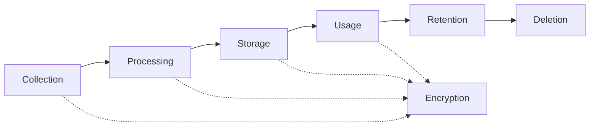

# OpenLifeOS Security & Privacy Documentation

## Table of Contents

1. [Security Overview](#security-overview)
2. [Privacy Principles](#privacy-principles)
3. [Data Protection](#data-protection)
4. [Encryption](#encryption)
5. [Authentication & Authorization](#authentication--authorization)
6. [Plugin Security](#plugin-security)
7. [Network Security](#network-security)
8. [Compliance](#compliance)
9. [Security Best Practices](#security-best-practices)
10. [Vulnerability Management](#vulnerability-management)
11. [Incident Response](#incident-response)
12. [Privacy Controls](#privacy-controls)
13. [Audit & Monitoring](#audit--monitoring)
14. [Security Checklist](#security-checklist)

## Security Overview

OpenLifeOS implements defense-in-depth security with multiple layers of protection:

```
┌─────────────────────────────────────────┐
│         User Authentication              │
├─────────────────────────────────────────┤
│         Application Security             │
├─────────────────────────────────────────┤
│         Data Encryption                  │
├─────────────────────────────────────────┤
│         Network Security                 │
├─────────────────────────────────────────┤
│         System Hardening                 │
└─────────────────────────────────────────┘
```

### Security Architecture

- **Zero-Trust Model**: Never trust, always verify
- **Principle of Least Privilege**: Minimal access rights
- **Defense in Depth**: Multiple security layers
- **Privacy by Design**: Built-in privacy protection
- **Open Source Security**: Transparent and auditable

## Privacy Principles

### Our Commitments

1. **Data Ownership**: You own your data, always
2. **Local-First**: Process data locally when possible
3. **Explicit Consent**: Clear permission for any data use
4. **Data Minimization**: Collect only what's necessary
5. **Transparency**: Clear about what we do with data
6. **User Control**: Easy data management and deletion
7. **No Selling Data**: Never sell or rent user data
8. **Security First**: Protect data with strong encryption

### Privacy Modes

#### 🔒 Local-Only Mode
```json
{
  "privacy": {
    "mode": "local",
    "telemetry": false,
    "analytics": false,
    "cloudSync": false,
    "externalAPIs": false
  }
}
```

#### 🔐 Hybrid Mode
```json
{
  "privacy": {
    "mode": "hybrid",
    "telemetry": "anonymous",
    "analytics": "aggregated",
    "cloudSync": "encrypted",
    "externalAPIs": "permitted"
  }
}
```

#### ☁️ Cloud Mode
```json
{
  "privacy": {
    "mode": "cloud",
    "telemetry": "detailed",
    "analytics": "full",
    "cloudSync": "automatic",
    "externalAPIs": "enabled"
  }
}
```

## Data Protection

### Data Classification

| Level | Type | Examples | Protection |
|-------|------|----------|------------|
| Critical | Health/Financial | Medical records, bank data | AES-256, Zero-knowledge |
| Sensitive | Personal | Name, location, habits | AES-256, Encrypted storage |
| Internal | System | Logs, metrics, settings | AES-128, Access control |
| Public | Shared | Public profile, shared data | HTTPS, Integrity checks |

### Data Lifecycle



### Data Storage Security

```javascript
// Secure storage implementation
class SecureStorage {
  async store(key, data, classification = 'sensitive') {
    // Encrypt based on classification
    const encrypted = await this.encrypt(data, classification);
    
    // Add integrity check
    const hash = await this.hash(encrypted);
    
    // Store with metadata
    await storage.set(key, {
      data: encrypted,
      hash: hash,
      classification: classification,
      timestamp: Date.now(),
      version: 1
    });
  }
  
  async retrieve(key) {
    const stored = await storage.get(key);
    
    // Verify integrity
    const currentHash = await this.hash(stored.data);
    if (currentHash !== stored.hash) {
      throw new Error('Data integrity check failed');
    }
    
    // Decrypt data
    return await this.decrypt(stored.data, stored.classification);
  }
}
```

## Encryption

### Encryption Standards

- **At Rest**: AES-256-GCM
- **In Transit**: TLS 1.3
- **Key Derivation**: PBKDF2 with 100,000 iterations
- **Password Hashing**: Argon2id
- **Digital Signatures**: Ed25519

### Implementation Examples

#### Data Encryption
```javascript
const crypto = require('crypto');

class EncryptionService {
  constructor() {
    this.algorithm = 'aes-256-gcm';
    this.saltLength = 64;
    this.ivLength = 16;
    this.tagLength = 16;
    this.iterations = 100000;
  }
  
  async encrypt(text, password) {
    const salt = crypto.randomBytes(this.saltLength);
    const iv = crypto.randomBytes(this.ivLength);
    
    // Derive key from password
    const key = crypto.pbkdf2Sync(
      password,
      salt,
      this.iterations,
      32,
      'sha256'
    );
    
    // Encrypt
    const cipher = crypto.createCipheriv(this.algorithm, key, iv);
    const encrypted = Buffer.concat([
      cipher.update(text, 'utf8'),
      cipher.final()
    ]);
    
    // Get auth tag
    const tag = cipher.getAuthTag();
    
    // Combine all parts
    return Buffer.concat([
      salt,
      iv,
      tag,
      encrypted
    ]).toString('base64');
  }
  
  async decrypt(encryptedText, password) {
    const data = Buffer.from(encryptedText, 'base64');
    
    // Extract parts
    const salt = data.slice(0, this.saltLength);
    const iv = data.slice(this.saltLength, this.saltLength + this.ivLength);
    const tag = data.slice(
      this.saltLength + this.ivLength,
      this.saltLength + this.ivLength + this.tagLength
    );
    const encrypted = data.slice(this.saltLength + this.ivLength + this.tagLength);
    
    // Derive key
    const key = crypto.pbkdf2Sync(
      password,
      salt,
      this.iterations,
      32,
      'sha256'
    );
    
    // Decrypt
    const decipher = crypto.createDecipheriv(this.algorithm, key, iv);
    decipher.setAuthTag(tag);
    
    return decipher.update(encrypted) + decipher.final('utf8');
  }
}
```

#### Key Management
```javascript
class KeyManager {
  constructor() {
    this.keys = new Map();
    this.rotationInterval = 30 * 24 * 60 * 60 * 1000; // 30 days
  }
  
  async generateMasterKey() {
    // Generate from hardware security module if available
    if (this.hasHSM()) {
      return await this.hsm.generateKey();
    }
    
    // Otherwise use secure random
    return crypto.randomBytes(32);
  }
  
  async deriveKey(masterKey, purpose) {
    const salt = Buffer.from(purpose, 'utf8');
    return crypto.pbkdf2Sync(masterKey, salt, 10000, 32, 'sha256');
  }
  
  async rotateKeys() {
    const newMasterKey = await this.generateMasterKey();
    
    // Re-encrypt all data with new key
    await this.reencryptData(newMasterKey);
    
    // Store new key securely
    await this.secureStore(newMasterKey);
    
    // Schedule next rotation
    setTimeout(() => this.rotateKeys(), this.rotationInterval);
  }
}
```

## Authentication & Authorization

### Authentication Methods

#### Multi-Factor Authentication (MFA)
```javascript
class MFAService {
  async setupTOTP(userId) {
    const secret = speakeasy.generateSecret({
      name: `OpenLifeOS (${userId})`,
      length: 32
    });
    
    // Store encrypted secret
    await this.storeSecret(userId, secret.base32);
    
    // Generate QR code
    const qrCode = await QRCode.toDataURL(secret.otpauth_url);
    
    return {
      secret: secret.base32,
      qrCode: qrCode
    };
  }
  
  async verifyTOTP(userId, token) {
    const secret = await this.getSecret(userId);
    
    return speakeasy.totp.verify({
      secret: secret,
      encoding: 'base32',
      token: token,
      window: 2
    });
  }
  
  async setupWebAuthn(userId) {
    const challenge = crypto.randomBytes(32);
    
    const publicKeyCredentialCreationOptions = {
      challenge: challenge,
      rp: {
        name: "OpenLifeOS",
        id: "openlifeos.dev",
      },
      user: {
        id: Buffer.from(userId),
        name: userId,
        displayName: userId,
      },
      pubKeyCredParams: [
        { alg: -7, type: "public-key" },  // ES256
        { alg: -257, type: "public-key" } // RS256
      ],
      authenticatorSelection: {
        authenticatorAttachment: "platform",
        userVerification: "required"
      },
      timeout: 60000,
      attestation: "direct"
    };
    
    return publicKeyCredentialCreationOptions;
  }
}
```

### Authorization System

```javascript
class AuthorizationService {
  constructor() {
    this.permissions = new Map();
    this.roles = new Map();
  }
  
  defineRole(name, permissions) {
    this.roles.set(name, {
      name: name,
      permissions: new Set(permissions),
      created: Date.now()
    });
  }
  
  async authorize(userId, resource, action) {
    // Get user roles
    const userRoles = await this.getUserRoles(userId);
    
    // Check each role for permission
    for (const role of userRoles) {
      const roleData = this.roles.get(role);
      const permission = `${resource}:${action}`;
      
      if (roleData.permissions.has(permission)) {
        // Log successful authorization
        await this.auditLog('authorize', {
          userId,
          resource,
          action,
          result: 'granted',
          role
        });
        return true;
      }
    }
    
    // Log failed authorization
    await this.auditLog('authorize', {
      userId,
      resource,
      action,
      result: 'denied'
    });
    
    return false;
  }
}

// Define roles
authService.defineRole('user', [
  'profile:read',
  'profile:write',
  'data:read',
  'data:write'
]);

authService.defineRole('admin', [
  'profile:*',
  'data:*',
  'system:*',
  'users:*'
]);
```

### Session Management

```javascript
class SessionManager {
  constructor() {
    this.sessions = new Map();
    this.sessionTimeout = 30 * 60 * 1000; // 30 minutes
  }
  
  async createSession(userId, metadata = {}) {
    const sessionId = crypto.randomBytes(32).toString('hex');
    const session = {
      id: sessionId,
      userId: userId,
      created: Date.now(),
      lastAccess: Date.now(),
      metadata: metadata,
      csrfToken: crypto.randomBytes(32).toString('hex')
    };
    
    // Store session
    this.sessions.set(sessionId, session);
    
    // Set expiration
    setTimeout(() => this.destroySession(sessionId), this.sessionTimeout);
    
    return session;
  }
  
  async validateSession(sessionId, csrfToken = null) {
    const session = this.sessions.get(sessionId);
    
    if (!session) {
      return false;
    }
    
    // Check expiration
    if (Date.now() - session.lastAccess > this.sessionTimeout) {
      await this.destroySession(sessionId);
      return false;
    }
    
    // Validate CSRF token if provided
    if (csrfToken && session.csrfToken !== csrfToken) {
      return false;
    }
    
    // Update last access
    session.lastAccess = Date.now();
    
    return session;
  }
}
```

## Plugin Security

### Plugin Sandboxing

```javascript
class PluginSandbox {
  constructor() {
    this.vm = require('vm');
    this.permissions = new Set();
  }
  
  async executePlugin(code, context, permissions) {
    // Create sandboxed context
    const sandbox = {
      console: this.createSafeConsole(),
      setTimeout: this.createSafeTimer(),
      setInterval: this.createSafeTimer(),
      // Limited API access
      lifeOS: this.createRestrictedAPI(permissions),
      // No dangerous globals
      process: undefined,
      require: undefined,
      __dirname: undefined,
      __filename: undefined,
      module: undefined,
      exports: undefined
    };
    
    // Create context
    const vmContext = this.vm.createContext(sandbox);
    
    // Execute with timeout
    const script = new this.vm.Script(code, {
      timeout: 5000,
      displayErrors: true
    });
    
    try {
      return script.runInContext(vmContext);
    } catch (error) {
      // Log security violation
      await this.logViolation({
        plugin: context.pluginId,
        error: error.message,
        code: code.substring(0, 100)
      });
      throw new Error('Plugin execution failed');
    }
  }
  
  createRestrictedAPI(permissions) {
    return {
      storage: permissions.has('storage') ? this.storage : undefined,
      network: permissions.has('network') ? this.network : undefined,
      ui: permissions.has('ui') ? this.ui : undefined
    };
  }
}
```

### Plugin Verification

```javascript
class PluginVerifier {
  async verifyPlugin(pluginPath) {
    const manifest = await this.loadManifest(pluginPath);
    
    // Verify signature
    if (!await this.verifySignature(manifest)) {
      throw new Error('Invalid plugin signature');
    }
    
    // Check permissions
    const dangerousPermissions = [
      'system.execute',
      'filesystem.write',
      'network.unrestricted'
    ];
    
    const requested = manifest.permissions || [];
    const dangerous = requested.filter(p => 
      dangerousPermissions.includes(p)
    );
    
    if (dangerous.length > 0) {
      // Require explicit user approval
      const approved = await this.requestUserApproval(
        manifest.name,
        dangerous
      );
      
      if (!approved) {
        throw new Error('Plugin permissions denied');
      }
    }
    
    // Scan for malicious code
    await this.scanForMalware(pluginPath);
    
    return {
      verified: true,
      manifest: manifest,
      permissions: requested
    };
  }
}
```

## Network Security

### TLS Configuration

```nginx
# nginx.conf
server {
    listen 443 ssl http2;
    server_name openlifeos.yourdomain.com;
    
    # Modern TLS configuration
    ssl_protocols TLSv1.3 TLSv1.2;
    ssl_ciphers ECDHE-ECDSA-AES128-GCM-SHA256:ECDHE-RSA-AES128-GCM-SHA256:ECDHE-ECDSA-AES256-GCM-SHA384:ECDHE-RSA-AES256-GCM-SHA384;
    ssl_prefer_server_ciphers off;
    
    # OCSP Stapling
    ssl_stapling on;
    ssl_stapling_verify on;
    ssl_trusted_certificate /path/to/root_CA_cert_plus_intermediates;
    
    # Security headers
    add_header Strict-Transport-Security "max-age=63072000; includeSubDomains; preload" always;
    add_header X-Frame-Options "DENY" always;
    add_header X-Content-Type-Options "nosniff" always;
    add_header X-XSS-Protection "1; mode=block" always;
    add_header Referrer-Policy "strict-origin-when-cross-origin" always;
    add_header Content-Security-Policy "default-src 'self'; script-src 'self' 'unsafe-inline'; style-src 'self' 'unsafe-inline'; img-src 'self' data: https:; font-src 'self'; connect-src 'self'; media-src 'self'; object-src 'none'; frame-src 'none'; base-uri 'self'; form-action 'self'; frame-ancestors 'none'; upgrade-insecure-requests;" always;
    add_header Permissions-Policy "geolocation=(), microphone=(), camera=(), payment=(), usb=(), magnetometer=(), accelerometer=(), gyroscope=()" always;
}
```

### API Security

```javascript
// Rate limiting
const rateLimit = require('express-rate-limit');

const apiLimiter = rateLimit({
  windowMs: 15 * 60 * 1000, // 15 minutes
  max: 100, // limit each IP to 100 requests per windowMs
  message: 'Too many requests from this IP',
  standardHeaders: true,
  legacyHeaders: false,
});

// Input validation
const validator = require('express-validator');

app.post('/api/data',
  apiLimiter,
  [
    validator.body('type').isIn(['biometric', 'environmental', 'digital']),
    validator.body('value').isNumeric(),
    validator.body('timestamp').isISO8601()
  ],
  async (req, res) => {
    const errors = validator.validationResult(req);
    if (!errors.isEmpty()) {
      return res.status(400).json({ errors: errors.array() });
    }
    // Process valid input
  }
);

// CORS configuration
const cors = require('cors');

const corsOptions = {
  origin: function (origin, callback) {
    const allowedOrigins = [
      'https://openlifeos.dev',
      'https://app.openlifeos.dev'
    ];
    
    if (!origin || allowedOrigins.indexOf(origin) !== -1) {
      callback(null, true);
    } else {
      callback(new Error('Not allowed by CORS'));
    }
  },
  credentials: true,
  optionsSuccessStatus: 200
};

app.use(cors(corsOptions));
```

### Firewall Rules

```bash
#!/bin/bash
# firewall-setup.sh

# Reset firewall
iptables -F
iptables -X

# Default policies
iptables -P INPUT DROP
iptables -P FORWARD DROP
iptables -P OUTPUT ACCEPT

# Allow loopback
iptables -A INPUT -i lo -j ACCEPT
iptables -A OUTPUT -o lo -j ACCEPT

# Allow established connections
iptables -A INPUT -m conntrack --ctstate ESTABLISHED,RELATED -j ACCEPT

# Allow SSH (rate limited)
iptables -A INPUT -p tcp --dport 22 -m conntrack --ctstate NEW -m recent --set
iptables -A INPUT -p tcp --dport 22 -m conntrack --ctstate NEW -m recent --update --seconds 60 --hitcount 4 -j DROP
iptables -A INPUT -p tcp --dport 22 -j ACCEPT

# Allow HTTPS
iptables -A INPUT -p tcp --dport 443 -j ACCEPT

# Allow HTTP (redirect to HTTPS)
iptables -A INPUT -p tcp --dport 80 -j ACCEPT

# DDoS protection
iptables -A INPUT -p tcp --tcp-flags ALL NONE -j DROP
iptables -A INPUT -p tcp --tcp-flags SYN,FIN SYN,FIN -j DROP
iptables -A INPUT -p tcp --tcp-flags SYN,RST SYN,RST -j DROP
iptables -A INPUT -p tcp --tcp-flags FIN,RST FIN,RST -j DROP
iptables -A INPUT -p tcp --tcp-flags ACK,FIN FIN -j DROP
iptables -A INPUT -p tcp --tcp-flags ACK,PSH PSH -j DROP
iptables -A INPUT -p tcp --tcp-flags ACK,URG URG -j DROP

# Save rules
iptables-save > /etc/iptables/rules.v4
```

## Compliance

### GDPR Compliance

```javascript
class GDPRCompliance {
  // Right to Access
  async exportUserData(userId) {
    const data = await this.collectAllUserData(userId);
    
    return {
      profile: data.profile,
      biometric: data.biometric,
      behavioral: data.behavioral,
      preferences: data.preferences,
      exportDate: new Date().toISOString(),
      format: 'json'
    };
  }
  
  // Right to Erasure
  async deleteUserData(userId) {
    // Verify user identity
    await this.verifyIdentity(userId);
    
    // Delete from all systems
    await Promise.all([
      this.deleteFromDatabase(userId),
      this.deleteFromCache(userId),
      this.deleteFromBackups(userId),
      this.deleteFromAnalytics(userId)
    ]);
    
    // Log deletion
    await this.logDeletion(userId);
    
    return {
      deleted: true,
      timestamp: Date.now()
    };
  }
  
  // Right to Rectification
  async updateUserData(userId, updates) {
    // Validate updates
    await this.validateUpdates(updates);
    
    // Apply updates
    await this.applyUpdates(userId, updates);
    
    // Log changes
    await this.logChanges(userId, updates);
  }
  
  // Consent Management
  async updateConsent(userId, consents) {
    await this.storage.set(`consent:${userId}`, {
      marketing: consents.marketing || false,
      analytics: consents.analytics || false,
      personalisation: consents.personalisation || false,
      thirdParty: consents.thirdParty || false,
      timestamp: Date.now()
    });
  }
}
```

### HIPAA Compliance

```javascript
class HIPAACompliance {
  constructor() {
    this.phiFields = [
      'medicalHistory',
      'medications',
      'diagnoses',
      'treatments'
    ];
  }
  
  // Access controls
  async accessPHI(userId, requesterId) {
    // Verify authorization
    const authorized = await this.verifyAuthorization(
      requesterId,
      'phi:read',
      userId
    );
    
    if (!authorized) {
      await this.logUnauthorizedAccess(requesterId, userId);
      throw new Error('Unauthorized PHI access');
    }
    
    // Log access
    await this.auditLog({
      action: 'PHI_ACCESS',
      user: userId,
      requester: requesterId,
      timestamp: Date.now()
    });
    
    // Return encrypted data
    return await this.encryptPHI(data);
  }
  
  // Audit logging
  async auditLog(entry) {
    // HIPAA requires 6 year retention
    await this.storage.append('hipaa-audit-log', {
      ...entry,
      hash: this.hashEntry(entry),
      timestamp: Date.now()
    });
  }
}
```

## Security Best Practices

### For Users

1. **Strong Passwords**
   - Use unique, complex passwords
   - Enable password manager integration
   - Regular password rotation

2. **Multi-Factor Authentication**
   - Enable MFA for all accounts
   - Use hardware keys when possible
   - Backup recovery codes securely

3. **Privacy Settings**
   - Review and adjust privacy settings
   - Limit data sharing
   - Regular privacy audits

4. **Plugin Management**
   - Only install trusted plugins
   - Review plugin permissions
   - Keep plugins updated

### For Developers

```javascript
// Secure coding practices

// ❌ Bad: SQL injection vulnerability
const query = `SELECT * FROM users WHERE id = ${userId}`;

// ✅ Good: Parameterized query
const query = 'SELECT * FROM users WHERE id = ?';
db.query(query, [userId]);

// ❌ Bad: Storing passwords in plain text
const password = req.body.password;
await db.save({ password });

// ✅ Good: Hash passwords
const hashedPassword = await argon2.hash(req.body.password);
await db.save({ password: hashedPassword });

// ❌ Bad: Exposing sensitive data in logs
console.log('User data:', userData);

// ✅ Good: Sanitize logs
console.log('User action:', { 
  userId: userData.id, 
  action: userData.action 
});

// ❌ Bad: No input validation
app.post('/api/data', (req, res) => {
  processData(req.body);
});

// ✅ Good: Validate all input
app.post('/api/data', validateInput, (req, res) => {
  processData(req.sanitizedBody);
});
```

## Vulnerability Management

### Security Scanning

```bash
# Dependency scanning
npm audit
npm audit fix

# SAST (Static Application Security Testing)
eslint --ext .js,.ts src/ --config .eslintrc.security.js

# Container scanning
docker scan openlifeos:latest

# Infrastructure scanning
terraform plan -var-file=prod.tfvars | tfsec

# Penetration testing
nikto -h https://openlifeos.yourdomain.com
```

### Vulnerability Response

```javascript
class VulnerabilityManager {
  async handleVulnerability(vuln) {
    const severity = this.assessSeverity(vuln);
    
    switch(severity) {
      case 'CRITICAL':
        await this.emergencyResponse(vuln);
        await this.notifyUsers(vuln);
        await this.deployPatch(vuln);
        break;
        
      case 'HIGH':
        await this.schedulePatch(vuln, '24h');
        await this.notifyAdmins(vuln);
        break;
        
      case 'MEDIUM':
        await this.schedulePatch(vuln, '7d');
        await this.logVulnerability(vuln);
        break;
        
      case 'LOW':
        await this.schedulePatch(vuln, '30d');
        break;
    }
  }
  
  assessSeverity(vuln) {
    // CVSS scoring
    if (vuln.cvss >= 9.0) return 'CRITICAL';
    if (vuln.cvss >= 7.0) return 'HIGH';
    if (vuln.cvss >= 4.0) return 'MEDIUM';
    return 'LOW';
  }
}
```

## Incident Response

### Incident Response Plan

```markdown
## Phase 1: Detection & Analysis
1. Identify potential incident
2. Determine scope and impact
3. Classify incident severity
4. Activate response team

## Phase 2: Containment
1. Isolate affected systems
2. Preserve evidence
3. Prevent further damage
4. Document actions taken

## Phase 3: Eradication
1. Remove threat from environment
2. Patch vulnerabilities
3. Update security controls
4. Verify threat elimination

## Phase 4: Recovery
1. Restore systems from clean backups
2. Monitor for re-infection
3. Validate system integrity
4. Return to normal operations

## Phase 5: Post-Incident
1. Document lessons learned
2. Update response procedures
3. Implement preventive measures
4. Report to stakeholders
```

### Incident Response Code

```javascript
class IncidentResponse {
  async handleIncident(incident) {
    // Create incident record
    const incidentId = await this.createIncident(incident);
    
    // Notify response team
    await this.notifyTeam(incident);
    
    // Execute containment
    await this.containThreat(incident);
    
    // Collect evidence
    await this.collectEvidence(incidentId);
    
    // Start remediation
    await this.remediate(incident);
    
    // Generate report
    return await this.generateReport(incidentId);
  }
  
  async containThreat(incident) {
    if (incident.type === 'data_breach') {
      // Revoke compromised credentials
      await this.revokeCredentials(incident.affected);
      
      // Block suspicious IPs
      await this.blockIPs(incident.sourceIPs);
      
      // Enable enhanced monitoring
      await this.enableMonitoring('enhanced');
    }
  }
}
```

## Privacy Controls

### Data Anonymization

```javascript
class DataAnonymizer {
  anonymize(data) {
    return {
      // Remove direct identifiers
      id: this.hash(data.id),
      
      // Generalize quasi-identifiers
      age: this.generalizeAge(data.age),
      location: this.generalizeLocation(data.location),
      
      // Preserve utility
      heartRate: data.heartRate,
      steps: data.steps,
      sleepQuality: data.sleepQuality
    };
  }
  
  generalizeAge(age) {
    if (age < 20) return '< 20';
    if (age < 30) return '20-29';
    if (age < 40) return '30-39';
    if (age < 50) return '40-49';
    return '50+';
  }
  
  generalizeLocation(location) {
    // Return only country/region
    return {
      country: location.country,
      region: location.region
    };
  }
}
```

### Privacy Dashboard

```javascript
class PrivacyDashboard {
  async getPrivacyStatus(userId) {
    return {
      dataCollected: await this.getDataTypes(userId),
      dataSharingActive: await this.getSharingStatus(userId),
      thirdPartyAccess: await this.getThirdPartyAccess(userId),
      retentionPeriod: await this.getRetentionPeriod(userId),
      lastExport: await this.getLastExport(userId),
      privacyScore: await this.calculatePrivacyScore(userId)
    };
  }
  
  async calculatePrivacyScore(userId) {
    const factors = {
      localProcessing: 30,
      encryptionEnabled: 25,
      minimalDataCollection: 20,
      noThirdPartySharing: 15,
      regularDeletion: 10
    };
    
    let score = 0;
    const settings = await this.getUserSettings(userId);
    
    if (settings.localOnly) score += factors.localProcessing;
    if (settings.encryption) score += factors.encryptionEnabled;
    if (settings.dataMinimization) score += factors.minimalDataCollection;
    if (!settings.thirdPartySharing) score += factors.noThirdPartySharing;
    if (settings.autoDelete) score += factors.regularDeletion;
    
    return score;
  }
}
```

## Audit & Monitoring

### Security Monitoring

```javascript
class SecurityMonitor {
  constructor() {
    this.alerts = [];
    this.thresholds = {
      failedLogins: 5,
      apiRateLimit: 1000,
      suspiciousActivity: 3
    };
  }
  
  async monitor() {
    // Check for failed login attempts
    const failedLogins = await this.getFailedLogins();
    if (failedLogins > this.thresholds.failedLogins) {
      await this.alert('BRUTE_FORCE_ATTEMPT', { count: failedLogins });
    }
    
    // Monitor API usage
    const apiUsage = await this.getAPIUsage();
    if (apiUsage > this.thresholds.apiRateLimit) {
      await this.alert('API_ABUSE', { usage: apiUsage });
    }
    
    // Detect anomalies
    const anomalies = await this.detectAnomalies();
    if (anomalies.length > 0) {
      await this.alert('ANOMALY_DETECTED', { anomalies });
    }
  }
  
  async detectAnomalies() {
    // Machine learning-based anomaly detection
    const model = await this.loadAnomalyModel();
    const recentActivity = await this.getRecentActivity();
    
    return model.predict(recentActivity).filter(a => a.score > 0.8);
  }
}
```

### Audit Logging

```javascript
class AuditLogger {
  async log(event) {
    const entry = {
      timestamp: Date.now(),
      eventType: event.type,
      userId: event.userId,
      ipAddress: event.ip,
      userAgent: event.userAgent,
      action: event.action,
      resource: event.resource,
      result: event.result,
      metadata: event.metadata
    };
    
    // Add integrity check
    entry.hash = this.calculateHash(entry);
    
    // Store in append-only log
    await this.appendToLog(entry);
    
    // Real-time analysis
    await this.analyzeEntry(entry);
  }
  
  calculateHash(entry) {
    const content = JSON.stringify(entry);
    return crypto.createHash('sha256').update(content).digest('hex');
  }
  
  async verifyIntegrity() {
    const logs = await this.getAllLogs();
    
    for (let i = 0; i < logs.length; i++) {
      const entry = logs[i];
      const calculatedHash = this.calculateHash({
        ...entry,
        hash: undefined
      });
      
      if (calculatedHash !== entry.hash) {
        throw new Error(`Integrity violation at entry ${i}`);
      }
    }
    
    return true;
  }
}
```

## Security Checklist

### Installation Security
- [ ] Change all default passwords
- [ ] Enable firewall
- [ ] Configure SSL/TLS certificates
- [ ] Disable unnecessary services
- [ ] Set up secure backups

### Configuration Security
- [ ] Enable encryption at rest
- [ ] Configure secure session management
- [ ] Set up rate limiting
- [ ] Enable audit logging
- [ ] Configure CORS properly

### Operational Security
- [ ] Regular security updates
- [ ] Monitor security alerts
- [ ] Review audit logs
- [ ] Test backup recovery
- [ ] Conduct security training

### Plugin Security
- [ ] Review plugin permissions
- [ ] Verify plugin signatures
- [ ] Monitor plugin behavior
- [ ] Regular plugin updates
- [ ] Remove unused plugins

### Data Security
- [ ] Encrypt sensitive data
- [ ] Implement access controls
- [ ] Regular data backups
- [ ] Data retention policies
- [ ] Secure data deletion

### Network Security
- [ ] Use HTTPS everywhere
- [ ] Configure firewall rules
- [ ] Implement DDoS protection
- [ ] Monitor network traffic
- [ ] Regular penetration testing

### Compliance
- [ ] GDPR compliance (if EU users)
- [ ] CCPA compliance (if CA users)
- [ ] HIPAA compliance (if health data)
- [ ] Data localization requirements
- [ ] Regular compliance audits

---

## Security Resources

### Reporting Security Issues

**DO NOT** report security vulnerabilities through public GitHub issues.

Instead, please report them to:
- Email: security@openlifeos.dev
- PGP Key: [Download](https://openlifeos.dev/pgp-key.asc)
- Bug Bounty: [Program Details](https://openlifeos.dev/security/bug-bounty)

### Security Updates

Subscribe to security updates:
- Security Mailing List: security-announce@openlifeos.dev
- RSS Feed: https://openlifeos.dev/security/feed.xml
- Twitter: [@OpenLifeOSSecurity](https://twitter.com/OpenLifeOSSecurity)

### Additional Resources

- [OWASP Top 10](https://owasp.org/www-project-top-ten/)
- [CIS Security Benchmarks](https://www.cisecurity.org/cis-benchmarks/)
- [NIST Cybersecurity Framework](https://www.nist.gov/cyberframework)
- [Security Best Practices](https://openlifeos.dev/security/best-practices)

---

*Security is everyone's responsibility. Together, we build a safer OpenLifeOS.*

[Back to Documentation](README.md) | [Privacy Policy](PRIVACY.md) | [Terms of Service](TERMS.md)