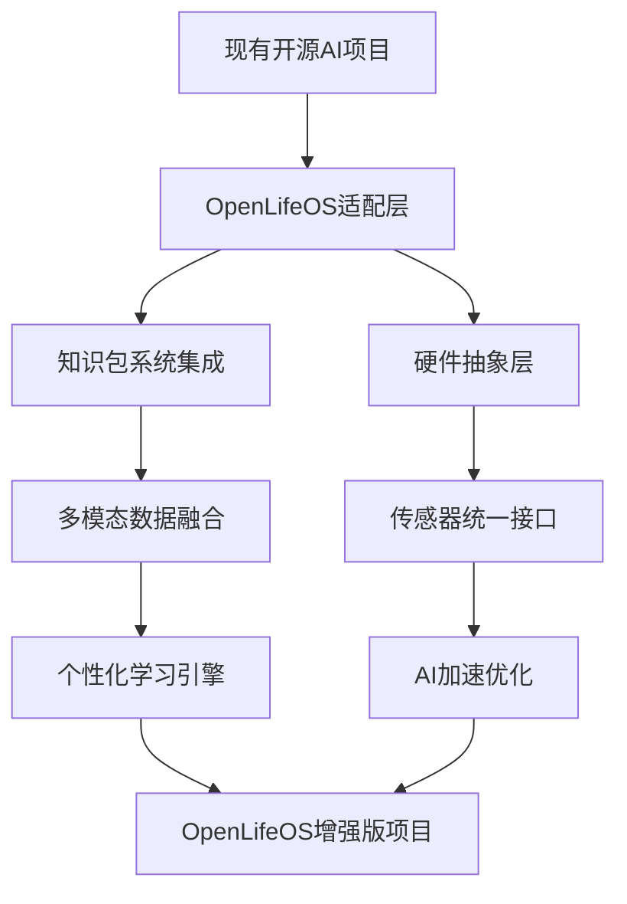

# OpenLifeOS 可穿戴AI设备集成指南

## 概述
OpenLifeOS作为"个人AI的Linux"，通过与最新AI眼镜、智能可穿戴设备和便携式AI硬件的深度集成，实现真正的无缝生活AI伴侣体验。结合Matrix风格知识下载系统，用户可在任何场景下瞬间获得专业级AI支持。

## 2025年可穿戴AI设备生态

### 市场现状
- **AI眼镜市场**：2024年同比激增210%，出货量首次突破200万台
- **可穿戴AI设备**：预计2029年达到1690亿美元市场规模
- **技术趋势**：AI + IoT + 5G实现真正实时响应

## 核心硬件设备集成

### 1. AI智能眼镜集成 👓

#### Ray-Ban Meta智能眼镜
```javascript
// OpenLifeOS集成配置
const rayBanMetaIntegration = {
    device: 'Ray-Ban Meta Smart Glasses',
    capabilities: [
        'real_time_visual_ai',
        'live_translation', 
        'hands_free_interaction',
        'pov_recording',
        'social_streaming'
    ],
    lifeOSFeatures: {
        knowledgePackages: [
            'visual-expert',      // 实时场景分析专家
            'travel-guide',       // 旅行向导
            'shopping-advisor',   // 购物助手
            'social-coach'        // 社交情商教练
        ],
        integrations: {
            camera: '12MP实时视觉分析',
            audio: '开放式立体声与AI语音',
            streaming: 'Instagram/Facebook直播',
            translation: '40+语言实时翻译'
        }
    }
};

// 使用示例：实时旅行专家
await lifeOS.wearable.connect('ray-ban-meta');
await lifeOS.knowledge.activate('travel-guide');

// 场景：在巴黎街头
user: *看着建筑* "这是什么建筑？"
lifeOS: "这是卢浮宫，建于12世纪，是世界最大的艺术博物馆。建议参观路线：金字塔入口→蒙娜丽莎→维纳斯→拿破仑厅。当前排队时间约45分钟，建议提前预订。"
```

#### Apple智能眼镜（2026年发布预期）
```javascript
const appleSmartGlassesIntegration = {
    device: 'Apple AI Smart Glasses',
    expectedLaunch: '2026年底',
    capabilities: [
        'visual_intelligence',
        'siri_activation',
        'live_translation',
        'turn_by_turn_navigation',
        'seamless_ios_integration'
    ],
    lifeOSAdvantages: {
        privateComputing: '本地AI处理，隐私优先',
        knowledgeDownload: 'Matrix风格专业知识包',
        crossPlatform: '跨Apple生态系统集成',
        openSource: '社区驱动功能开发'
    }
};
```

### 2. 便携式AI设备集成 🤖

#### Humane AI Pin重新定义
```javascript
// OpenLifeOS增强的AI Pin概念
const lifeOSAIPin = {
    device: 'OpenLifeOS Enhanced AI Pin',
    form: 'magnetic_chest_device',
    improvements: {
        batteryLife: '全天续航（vs原版4小时）',
        heatManagement: '智能功耗管理',
        uiExperience: 'OpenLifeOS直观界面',
        connectivity: '5G + WiFi + 蓝牙mesh'
    },
    uniqueFeatures: {
        matrixDownload: '胸前设备秒变专业顾问',
        biometricFusion: '心率+体温+语音情感分析',
        discreetInteraction: '微手势控制',
        emergencyMode: '健康异常自动求助'
    }
};

// 应用场景：医疗紧急情况
const emergencyScenario = {
    trigger: '检测到异常心率和血压',
    response: [
        '自动下载医疗专家知识包',
        '分析症状并提供初步建议', 
        '联系紧急联系人和医疗服务',
        '实时生命体征监控和指导'
    ]
};
```

#### Rabbit R1增强版
```javascript
const lifeOSRabbitR1 = {
    device: 'OpenLifeOS Rabbit R1+',
    enhancements: {
        knowledgePackages: '100+专业领域即时下载',
        largeActionModel: '结合OpenLifeOS行为预测',
        conversationalUI: '自然语言+视觉界面',
        taskAutomation: '跨应用复杂任务自动化'
    },
    scenarios: {
        businessTravel: {
            knowledge: 'business-travel-expert',
            actions: [
                '预订最优航班和酒店',
                '准备会议材料和行程',
                '实时翻译商务对话',
                '文化礼仪提醒'
            ]
        }
    }
};
```

### 3. 开源AI硬件生态集成 🔧

#### ESP32-S3 AI开发板集成
```javascript
// OpenLifeOS开源硬件集成
const esp32S3Integration = {
    device: 'ESP32-S3 AI Development Board',
    capabilities: [
        'edge_ai_processing',
        'voice_recognition', 
        'sensor_fusion',
        'local_ai_inference',
        'iot_connectivity'
    ],
    lifeOSAdvantages: {
        knowledgePackages: [
            'maker-expert',        // 创客专家知识包
            'iot-architect',       // 物联网架构师
            'hardware-debugger',   // 硬件调试专家
            'sensor-analyst'       // 传感器分析师
        ],
        techSpecs: {
            ai_acceleration: 'ESP-DL库优化，16位模型提速6.25倍',
            voice_processing: 'ESP-SR唤醒词检测 + ESP-TTS语音合成',
            connectivity: 'WiFi 6 + 蓝牙5.0 + LoRaWAN支持',
            power: '深度休眠模式，电池续航30天+'
        }
    }
};

// 使用场景：智能家居中心
const smartHomeDemo = {
    setup: 'ESP32-S3作为OpenLifeOS边缘计算节点',
    workflow: [
        '激活maker-expert知识包',
        '实时监控20+家居传感器',
        '本地AI推理，无需云端',
        'Matrix风格知识注入硬件控制专长'
    ]
};
```

#### Arduino Nano ESP32 集成
```javascript
const arduinoNanoESP32 = {
    device: 'Arduino Nano ESP32',
    positioning: 'OpenLifeOS教育和原型开发平台',
    integration: {
        aiLibraries: 'ESP32_AI_Connect库支持OpenAI/Gemini/Claude API',
        voiceAssistant: 'TensorFlow Lite本地语音识别',
        iotCloud: 'Arduino IoT Cloud无缝集成',
        programming: 'Arduino IDE + MicroPython双语言支持'
    },
    lifeOSApplications: {
        education: {
            target: '学生和初学者',
            features: [
                '19节课程体系学习IoT基础',
                '零代码AI模型部署',
                'OpenLifeOS知识包即插即用'
            ]
        },
        prototyping: {
            target: '创客和开发者',
            features: [
                '快速AI原型验证',
                '多传感器数据融合',
                'OpenLifeOS插件开发平台'
            ]
        }
    }
};
```

#### Raspberry Pi 5 + AI HAT+集成  
```javascript
const raspberryPi5AIKit = {
    device: 'Raspberry Pi 5 + AI HAT+',
    performance: '13/26 TOPS神经网络加速',
    positioning: 'OpenLifeOS高性能计算节点',
    capabilities: {
        aiAcceleration: 'Hailo-8L AI加速器，比单独Pi5快5.8倍',
        concurrency: '多AI模型并发处理',
        integration: 'Frigate视频监控 + Hailo官方集成',
        development: '完整Python生态 + OpenCV + TensorFlow'
    },
    lifeOSIntegration: {
        knowledgePackages: [
            'computer-vision-expert',  // 计算机视觉专家
            'robotics-engineer',       // 机器人工程师  
            'ai-researcher',          // AI研究员
            'edge-computing-architect' // 边缘计算架构师
        ],
        useCases: [
            '实时视频分析和物体识别',
            '多模态AI任务并行处理',
            'OpenLifeOS知识库训练和推理',
            '复杂机器人控制系统'
        ]
    }
};
```

#### 小智AI (Xiaozhi-ESP32) 开源项目集成
```javascript
const xiaozhi_esp32_lifeOS = {
    project: 'Xiaozhi-ESP32 + OpenLifeOS Enhancement',
    description: '将流行的小智AI开源项目升级为OpenLifeOS智能节点',
    originalFeatures: [
        '本地语音识别和命令控制',
        'WiFi/4G网络通信',
        '隐私优先的本地处理',
        '智能家居设备控制'
    ],
    lifeOSEnhancements: {
        knowledgePackages: '50+专业领域即时下载',
        personalityEvolution: 'AI个性与用户共同成长',
        multimodalFusion: '语音+视觉+环境多模态感知',
        predictiveActions: '主动预测用户需求',
        lifeLearning: '长期记忆和行为模式学习'
    },
    upgradeDemo: {
        before: '小智: "主人，我可以帮您开灯"',
        after: '小智: "根据您的作息模式，我预测您将在10分钟后需要温柔的灯光。另外，基于今天的工作压力指标，我建议播放舒缓音乐并下载wellness-expert知识包为您提供放松指导。"'
    }
};
```

### 4. 智能健康可穿戴集成 ⌚💊

#### Apple Watch + OpenLifeOS深度集成
```javascript
const appleWatchOpenLifeOS = {
    device: 'Apple Watch Series 9/10 + OpenLifeOS',
    healthFeatures: {
        continuousMonitoring: [
            'ECG心电图',
            'SpO2血氧',
            'sleep_analysis睡眠分析',
            'stress_detection压力检测',
            'irregular_heartbeat不规则心跳'
        ],
        lifeOSEnhancement: {
            predictiveWellness: '提前3小时预测健康风险',
            expertConsultation: '实时医疗专家知识包',
            lifestyleOptimization: '基于生理数据的生活建议',
            emergencyResponse: '智能紧急响应系统'
        }
    }
};

// 健康场景示例：预防性干预
const preventiveHealthcare = {
    scenario: '检测到压力水平上升+睡眠质量下降',
    lifeOSResponse: [
        '激活wellness-expert知识包',
        '分析压力源和睡眠模式',
        '推荐个性化减压方案',
        '调整日程安排减少压力源',
        '监控改善效果并调整方案'
    ]
};
```

#### WHOOP 5.0 + OpenLifeOS性能优化
```javascript
const whoopOpenLifeOS = {
    device: 'WHOOP 5.0 + OpenLifeOS',
    focus: 'athletic_performance_optimization',
    integration: {
        recoveryAnalysis: 'AI分析恢复状态',
        strainManagement: '训练负荷智能调节',
        sleepOptimization: '睡眠质量提升方案',
        performancePrediction: '比赛状态预测'
    },
    knowledgePackages: [
        'sports-scientist',    // 运动科学专家
        'nutrition-coach',     // 营养教练  
        'mental-performance',  // 心理表现教练
        'recovery-specialist'  // 恢复专家
    ]
};
```

## 具体应用场景演示

### 场景1：智能商务旅行 ✈️

**设备组合**: Ray-Ban Meta眼镜 + OpenLifeOS AI Pin + Apple Watch

```javascript
const businessTravelScenario = {
    day: '出差第一天',
    location: '东京商务会议',
    timeline: {
        '06:00': {
            trigger: 'Apple Watch检测到觉醒',
            action: '激活business-travel-expert知识包',
            response: [
                '分析今日日程和最优路线',
                '提供日本商务礼仪提醒',
                '检查航班状态和交通情况',
                '准备会议材料和翻译工具'
            ]
        },
        '09:30': {
            trigger: '到达会议地点（Ray-Ban Meta识别）',
            action: '实时场景分析和文化适应',
            response: [
                '识别与会人员和公司背景',
                '提供实时日语翻译',
                '商务卡片交换礼仪提醒',
                '记录会议要点和后续行动'
            ]
        },
        '18:00': {
            trigger: 'AI Pin检测到疲劳状态',
            action: '健康管理和恢复建议',
            response: [
                '推荐附近正宗餐厅',
                '预订明日最优回程航班',
                '安排放松和恢复活动',
                '时差调整和睡眠优化'
            ]
        }
    }
};
```

### 场景2：个人健康管理 🏥

**设备组合**: Apple Watch + Limitless Pendant + OpenLifeOS智能戒指

```javascript
const healthManagementScenario = {
    user: '45岁高血压患者',
    devices: {
        appleWatch: '连续心率和血压监测',
        limitlessPendant: '医生对话记录和分析', 
        smartRing: '睡眠和压力深度分析'
    },
    timeline: {
        '连续监测': {
            action: '24/7生命体征监控',
            triggers: [
                '血压异常→自动激活医疗专家包',
                '压力峰值→启动压力管理方案',
                '睡眠质量下降→调整作息建议'
            ]
        },
        '医生访问': {
            action: 'Limitless Pendant记录完整对话',
            processing: [
                '自动转录医疗对话',
                '提取关键医疗信息',
                '生成后续治疗计划',
                '设置用药和复诊提醒'
            ]
        },
        '日常管理': {
            action: '基于多维数据的健康优化',
            features: [
                '个性化运动建议',
                '饮食营养优化',
                '压力管理技巧',
                '睡眠质量改善'
            ]
        }
    }
};
```

### 场景3：教育学习增强 🎓

**设备组合**: 智能眼镜 + AI学习笔 + 智能耳机

```javascript
const educationScenario = {
    user: 'MBA学生',
    setting: '哈佛商学院案例研究课程',
    devices: {
        smartGlasses: '实时信息叠加和记录',
        aiPen: '笔记自动整理和分析',
        smartEarbuds: '课堂音频增强和翻译'
    },
    workflow: {
        '课前准备': {
            action: '下载business-strategy-expert知识包',
            features: [
                '案例背景自动研究',
                '相关理论框架预习',
                '行业趋势分析准备',
                '讨论要点提前准备'
            ]
        },
        '课堂参与': {
            action: '实时智能辅助学习',
            features: [
                '教授讲解要点自动标记',
                '复杂概念实时解释',
                '相关案例和数据补充',
                '同学发言要点记录'
            ]
        },
        '课后复习': {
            action: '知识整合和深化',
            features: [
                '笔记自动整理成思维导图',
                '相关阅读材料推荐',
                '知识点练习题生成',
                '小组讨论要点准备'
            ]
        }
    }
};
```

### 场景4：创意工作增强 🎨

**设备组合**: AR眼镜 + 智能手环 + 环境传感器

```javascript
const creativeWorkScenario = {
    user: '建筑设计师',
    project: '智慧城市办公楼设计',
    devices: {
        arGlasses: '3D设计可视化和空间分析',
        smartBracelet: '创作状态监控',
        environmentSensors: '工作环境优化'
    },
    workflow: {
        '设计构思': {
            knowledge: 'architecture-expert + sustainability-advisor',
            features: [
                '现场环境3D扫描建模',
                '可持续设计方案建议',
                '法规合规性实时检查',
                '成本估算和优化建议'
            ]
        },
        '客户展示': {
            action: 'AR实时建筑可视化',
            features: [
                '1:1比例建筑模型展示',
                '不同时间光照效果模拟',
                '内部空间漫游体验',
                '设计变更实时预览'
            ]
        },
        '协作设计': {
            action: '远程团队协作',
            features: [
                '多人AR空间共享',
                '实时设计修改同步',
                '专业意见智能整合',
                '项目进度自动跟踪'
            ]
        }
    }
};
```

## 开源AI硬件开发者生态

### 开源硬件支持矩阵

| 硬件平台 | OpenLifeOS支持度 | AI加速 | 知识包容量 | 开发难度 | 成本 | 最佳用途 |
|---------|-------------|-------|-----------|---------|-----|---------|
| ESP32-S3 | ⭐⭐⭐⭐⭐ | ESP-DL | 5-10个 | 简单 | $10-20 | IoT边缘节点 |
| Arduino Nano ESP32 | ⭐⭐⭐⭐ | TensorFlow Lite | 3-5个 | 很简单 | $15-25 | 教育原型 |
| Raspberry Pi 5 + AI HAT+ | ⭐⭐⭐⭐⭐ | Hailo-8L | 50+个 | 中等 | $100-150 | 高性能应用 |
| Xiaozhi-ESP32 | ⭐⭐⭐⭐ | ESP-DL | 10-15个 | 简单 | $25-35 | 智能家居 |
| XIAO ESP32-S3 | ⭐⭐⭐⭐ | SenseCraft AI | 8-12个 | 简单 | $8-15 | 微型应用 |

### OpenLifeOS开源硬件开发工具链

```javascript
// OpenLifeOS开源硬件SDK
class OpenLifeOSHardwareSDK {
    constructor(platform) {
        this.platform = platform;
        this.knowledgeManager = new KnowledgePackageManager();
        this.sensors = new SensorFusion();
        this.ai = new EdgeAI(platform);
    }
    
    // 统一硬件抽象接口
    async initializeHardware() {
        switch(this.platform) {
            case 'ESP32-S3':
                return await this.initESP32S3();
            case 'Arduino_Nano_ESP32':
                return await this.initArduinoNano();
            case 'Raspberry_Pi_5':
                return await this.initRaspberryPi5();
            case 'Xiaozhi_ESP32':
                return await this.initXiaozhiESP32();
        }
    }
    
    // 知识包部署接口
    async deployKnowledgePackage(packageId, platform_optimization = true) {
        const package = await this.knowledgeManager.getPackage(packageId);
        
        // 根据硬件平台优化模型
        if (platform_optimization) {
            package.model = await this.optimizeForPlatform(package.model);
        }
        
        return await this.ai.deploy(package);
    }
}
```

### 社区项目集成指南

#### 1. 现有项目升级流程


#### 2. 开发者贡献框架
```javascript
// 开源贡献者API
const lifeOSContributor = {
    // 提交新硬件支持
    submitHardwareSupport: {
        platform: 'your_hardware_platform',
        driverCode: 'hardware_driver.js',
        testSuite: 'platform_tests.js',
        documentation: 'integration_guide.md',
        knowledgePackages: ['supported-packages-list']
    },
    
    // 提交知识包
    submitKnowledgePackage: {
        domain: 'your_expertise_domain',
        model: 'trained_model_files',
        persona: 'expert_personality_config',
        validation: 'accuracy_metrics',
        hardwareSupport: ['compatible-platforms']
    },
    
    // 提交集成案例
    submitIntegrationCase: {
        useCase: 'specific_application',
        hardware: 'required_hardware_list',  
        codeExample: 'complete_implementation',
        performanceMetrics: 'benchmarking_results',
        videoDemo: 'demonstration_video'
    }
};
```

## OpenLifeOS集成技术架构

### 硬件抽象层
```typescript
interface WearableDevice {
    deviceId: string;
    deviceType: 'smart_glasses' | 'ai_pin' | 'smart_watch' | 'pendant' | 'ring';
    capabilities: DeviceCapability[];
    sensors: Sensor[];
    connectivity: ConnectionMethod[];
    
    // OpenLifeOS集成接口
    lifeOSInterface: {
        knowledgePackageSupport: boolean;
        biometricDataStream: boolean;
        realTimeProcessing: boolean;
        emergencyResponse: boolean;
    };
}

interface DeviceCapability {
    name: string;
    type: 'input' | 'output' | 'processing' | 'storage';
    realTime: boolean;
    accuracy: number;
    powerConsumption: 'low' | 'medium' | 'high';
}
```

### 统一数据流处理
```javascript
class WearableDataProcessor {
    constructor() {
        this.connectedDevices = new Map();
        this.dataStreams = new Map();
        this.knowledgePackages = new Map();
    }
    
    async processMultiDeviceData(deviceInputs) {
        // 融合多设备数据
        const fusedData = this.fuseMultiModalData(deviceInputs);
        
        // 激活相关知识包
        const relevantExperts = await this.selectRelevantKnowledgePackages(fusedData);
        
        // 生成智能响应
        const response = await this.generateIntelligentResponse(fusedData, relevantExperts);
        
        // 分发到适合的输出设备
        await this.distributeResponse(response);
        
        return response;
    }
}
```

## 隐私和安全考虑

### 数据保护策略
```javascript
const privacyFramework = {
    dataProcessing: {
        location: '优先本地处理',
        encryption: '端到端加密',
        storage: '用户设备本地存储',
        sharing: '显式用户授权'
    },
    biometricData: {
        collection: '最小化数据收集',
        anonymization: '自动数据去标识化',
        retention: '用户可控数据保留',
        deletion: '用户随时删除权利'
    },
    knowledgePackages: {
        verification: '数字签名验证',
        sandboxing: '隔离执行环境',
        audit: '完整使用日志记录',
        transparency: '开源代码审计'
    }
};
```

## 商业模式和市场机会

### 设备制造商合作
```javascript
const partnershipModel = {
    rayBanMeta: {
        integration: 'OpenLifeOS作为智能软件层',
        revenue: '软件授权 + 知识包订阅',
        differentiation: 'Matrix风格专业知识下载'
    },
    appleWatch: {
        integration: '第三方OpenLifeOS应用',
        revenue: 'App Store收益分成',
        differentiation: '预测性健康管理'
    },
    startups: {
        integration: '深度定制硬件+软件',
        revenue: '联合品牌产品',
        differentiation: '专用OpenLifeOS硬件生态'
    }
};
```

### 市场定位
- **B2C市场**: $29/月订阅，支持3-5个设备
- **B2B市场**: $99/用户/月，企业级管理和安全
- **设备制造商**: 授权费用 + 收益分成模式

## 发展路线图

### 2025年Q1-Q2：基础集成
- Ray-Ban Meta眼镜集成
- Apple Watch深度健康监控
- 基础知识包系统（5个领域）

### 2025年Q3-Q4：扩展生态
- 10+设备制造商合作
- 20+专业知识包
- 多设备协同系统

### 2026年：下一代体验
- Apple智能眼镜集成
- 脑机接口探索
- 全场景无缝AI伴侣

## 竞争优势总结

### vs 传统可穿戴设备
- **OpenLifeOS**: 智能分析 + 专业知识 + 预测性建议
- **传统设备**: 简单数据记录和基础提醒

### vs AI助手应用
- **OpenLifeOS**: 硬件深度集成 + 实时处理 + 专业知识下载
- **AI应用**: 软件层面 + 延迟响应 + 通用建议

### vs 封闭生态
- **OpenLifeOS**: 开源平台 + 跨设备兼容 + 社区驱动
- **封闭生态**: 厂商锁定 + 有限兼容 + 功能受限

## 开源硬件开发路线图

### 2025年Q1-Q2：基础开源平台
- ESP32-S3 + Arduino Nano ESP32全面支持
- 开源硬件SDK发布 
- 社区开发者工具链
- 5个核心知识包适配

### 2025年Q3-Q4：生态扩展
- Raspberry Pi 5 + AI HAT+深度集成
- 20+开源项目官方支持
- 开发者贡献平台上线
- 硬件厂商合作计划

### 2026年：开源生态成熟
- 100+开源硬件平台支持
- 社区驱动的知识包市场
- 跨平台开发标准制定
- 全球开发者大会

## 开发者社区建设

### 技术支持体系
```javascript
const communitySupport = {
    documentation: {
        quickStart: '5分钟快速上手指南',
        apiReference: '完整API参考文档',
        hardwareGuides: '各平台详细集成指南',
        troubleshooting: '常见问题解决方案'
    },
    
    codeRepository: {
        github: 'github.com/openopenlifeos/open-hardware',
        examples: '100+实际项目案例',
        templates: '各平台项目模板',
        libraries: '优化的硬件驱动库'
    },
    
    community: {
        discord: 'openopenlifeos-hardware频道',
        forum: '技术讨论和经验分享',
        hackathons: '月度硬件创意比赛',
        bounties: '开源贡献奖励计划'
    }
};
```

### 生态合作伙伴
- **Espressif**: ESP32-S3官方合作
- **Arduino**: 教育市场深度合作  
- **Raspberry Pi基金会**: AI HAT+联合开发
- **Seeed Studio**: XIAO系列定制版本
- **开源硬件厂商**: 批量采购和定制支持

## 结论

OpenLifeOS与2025年最新可穿戴AI设备的集成，将创造前所未有的智能生活体验。通过Matrix风格知识下载系统，每个可穿戴设备都能成为用户的专业顾问，实现从简单数据记录到智能生活伙伴的质的飞跃。

从商业设备到开源硬件，从简单传感器到AI加速器，OpenLifeOS为每一个层级的开发者和用户提供了完整的解决方案。无论是$10的ESP32-S3还是$150的Raspberry Pi 5 AI Kit，都能成为用户的智能伙伴。

这不仅是技术的进步，更是人类增强能力的新时代开始。在OpenLifeOS的赋能下，每个人都可以拥有随身携带的专业专家团队，让AI真正成为生活中不可或缺的智能伙伴。

**开源硬件 + 知识包系统 = 无限可能的AI未来**

---

*OpenLifeOS 可穿戴AI集成 - 让每个设备都成为你的专业顾问*  
*商业设备集成：[github.com/openopenlifeos/wearable-integrations](https://github.com/openopenlifeos/wearable-integrations)*  
*开源硬件支持：[github.com/openopenlifeos/open-hardware](https://github.com/openopenlifeos/open-hardware)*